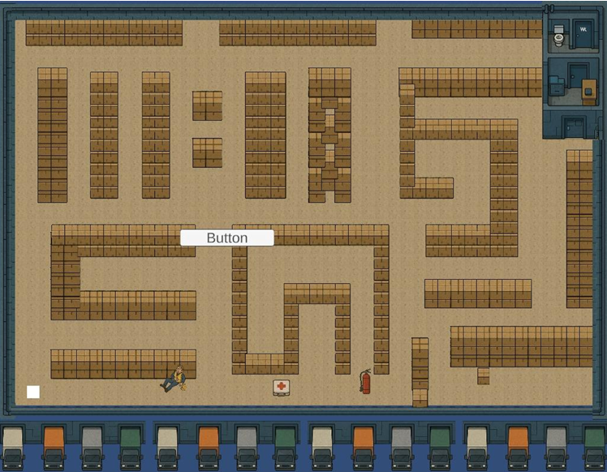
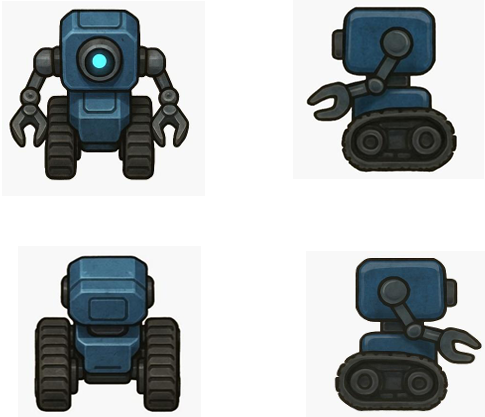

# 2D-warehouse-simulation-using-ai-search-algorithms

A 2D warehouse navigation simulation built in **Unity**, where an AI-powered robot autonomously performs tasks like retrieving goods, rescuing injured workers, and extinguishing fires — using classical and hybrid pathfinding algorithms implemented from scratch.

---

## About the Project

This project was developed as part of the MSc Computer Science (Semester IV) curriculum at **Kishinchand Chellaram College, HSNC University, Mumbai** (2024–25).

The simulation models a real-world industrial warehouse as a maze-like Tilemap environment. A robot agent navigates through it using five different AI search algorithms, allowing direct comparison of their efficiency across multiple emergency and logistics scenarios.

**Team:** Calvin Koshy · Diksha Jadhav · Vaishali Wankhede  
**Guided by:** Ms. Geeta Brijwani · Mrs. Jagruti Raut

---

## Built With

- **Unity** (2D Universal Render Pipeline)
- **C#**
- **Unity Tilemap** system for the warehouse grid
- **NavMesh** (NavMeshPlus for 2D) + custom grid-based pathfinding

---

## Algorithms Implemented

All algorithms were implemented from scratch in C#:

| Algorithm | Type | Description |
|---|---|---|
| BFS (Breadth-First Search) | Uninformed | Explores level by level; guarantees shortest path |
| A* | Informed | Uses Manhattan distance heuristic; balances cost + direction |
| Bidirectional A* | Hybrid | Simultaneous forward + backward A* search; reduces search space |
| BFS + A* | Hybrid | BFS phase for broad exploration, then A* for final approach |
| Dijkstra + A* | Hybrid | Dijkstra for cost-optimal early search, then A* for heuristic finish |

---

## Scenarios

Five distinct task scenarios were designed to stress-test each algorithm:

1. **Scenario 1** — Robot retrieves a box and delivers it to the exit
2. **Scenario 2** — Robot rescues an injured worker, picks up a fire extinguisher, and extinguishes a fire
3. **Scenario 3** — Robot retrieves a first aid kit and delivers it to an injured worker
4. **Scenario 4** — Robot retrieves multiple boxes and transports them all to the exit
5. **Scenario 5** — Full emergency: injured worker + first aid kit + fire extinguisher + box delivery

---

## Key Features

- **Dual navigation system** — NavMesh for general movement, custom grid-based logic for algorithm testing
- **Manual & dynamic algorithm switching** — switch algorithms mid-simulation at runtime
- **Real-time performance metrics** displayed on-screen: execution time, nodes explored, path length
- **Visual debug overlay** — color-coded node expansion, open lists, and final path highlight
- **Object placement** — dynamically place fires, boxes, injured workers, and first aid kits via mouse click
- **Pickup animations** — robot lifts objects and carries them to the destination
- **Worker rescue animation** — injured sprite switches to healthy on rescue

---

## Performance Metrics

Each algorithm was evaluated across all five scenarios using:

- **Execution time** (seconds)
- **Nodes explored** (search efficiency)
- **Path length** (route optimality)
- **Memory usage** (max nodes in memory)

### Sample Results

| Algorithm | Run | Time Taken | Nodes Explored | Path Length |
|---|---|---|---|---|
| BFS | Run 1 | 0.1304s | 57 | 19 |
| BFS | Run 3 | 5.7529s | 1240 | 97 |
| A* | Run 1 | 0.1185s | 44 | 19 |
| A* | Run 3 | 3.8000s | 737 | 108 |
| Bidirectional A* | Run 1 | 0.0989s | 41 | 19 |
| Bidirectional A* | Run 3 | 3.3514s | 750 | 100 |

> Bidirectional A* consistently achieved the fastest execution times and lowest node counts, especially on longer paths. BFS explored the most nodes due to its lack of heuristic guidance.

---

## Project Structure

```
Assets/
├── Scripts/
│   ├── RobotController.cs       # Robot movement, animation, task execution
│   ├── ScenarioManager.cs       # Scenario selection and task sequencing
│   ├── ObjectPlacer.cs          # Runtime object placement on the grid
│   ├── Node.cs                  # Grid node representation (walkable, costs)
│   ├── GridManager.cs           # Tilemap-to-grid conversion
│   └── Algorithms/
│       ├── BFS.cs
│       ├── AStar.cs
│       ├── BidirectionalAStar.cs
│       ├── BFSPlusAStar.cs
│       └── DijkstraPlusAStar.cs
├── Scenes/
│   └── SampleScene.unity
├── Tilemaps/                    # Warehouse tilemap assets
└── Prefabs/                     # Robot, box, fire, worker, first aid kit
```

---

## Research Paper

This project was also submitted as a research paper:

**"Comparative Analysis of AI Search Algorithms in Maze Environment"**  
Calvin Koshy, Diksha Jadhav, Vaishali Wankhede, Geeta Brijwani, Jagruti Raut  
Department of Computer Science, K.C. College, Churchgate, Mumbai

---

## Screenshots

### Warehouse Maze


### Robot Sprites

## Contributors

---

| | Name | GitHub |
|---|---|---|
| | Calvin Koshy | [@CalvinKoshy99](https://github.com/CalvinKoshy99) |
| | Diksha Jadhav | [@DIK5H4](https://github.com/DIK5H4) |
| | Vaishali Wankhede | [@vaishbil](https://github.com/vaishbil) |
